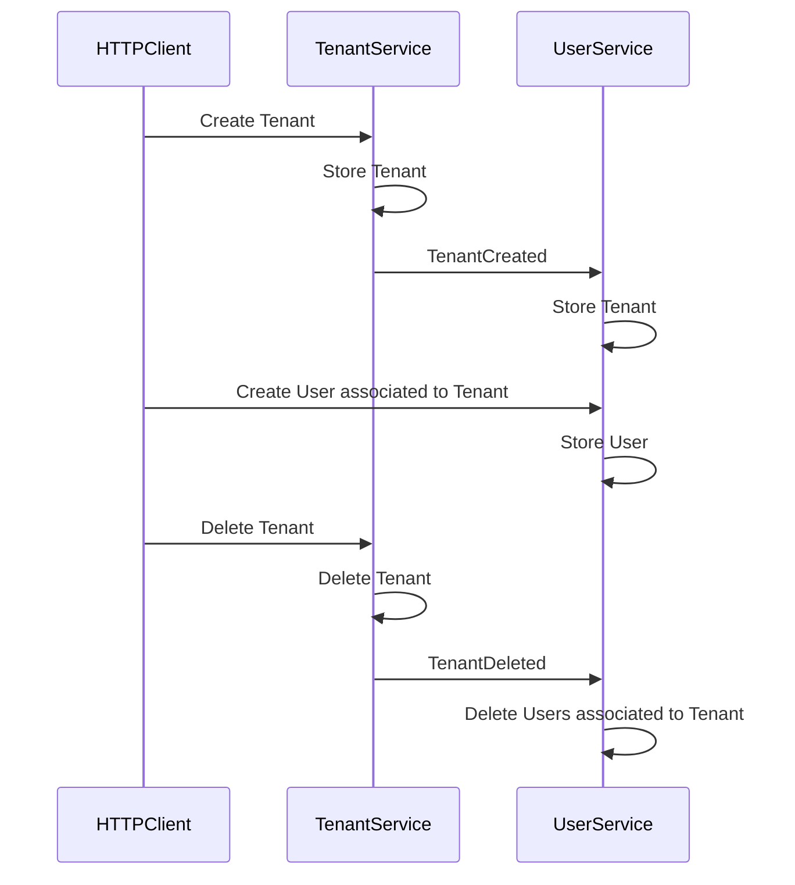

# Dapr Microservices

[](https://github.com/fawohlsc/dapr-microservices/actions/workflows/deployment.yml)

## Introduction

Sample outlining how Dapr can be used to build and run microservices on Azure. For educational purposes and the sake of simplicity, some shortcuts were taken. Nevertheless, the sample could act as a baseline and further evolved to become production-grade e.g.,
- Improve high availability and disaster recovery (See: [Guidance for Architecting Mission Critical Apps on Azure](https://techcommunity.microsoft.com/t5/azure-architecture-blog/guidance-for-architecting-mission-critical-apps-on-azure/ba-p/3201745)).
- Harden the microservices and infrastructure deployed to Azure (See: [Azure Security Benchmark](https://docs.microsoft.com/en-us/security/benchmark/azure/), [Baseline architecture for an Azure Kubernetes Service (AKS) cluster](https://docs.microsoft.com/en-us/azure/architecture/reference-architectures/containers/aks/secure-baseline-aks)).
- Evolve microservice design especially by clearly separating state stores (See: [Build microservices on Azure](https://docs.microsoft.com/en-us/azure/architecture/microservices/)).
- Leverage advanced branching and container management strategies (See: [Building a CI/CD pipeline for microservices on Kubernetes](https://docs.microsoft.com/en-us/azure/architecture/microservices/ci-cd-kubernetes)).

## High-level Architecture

Tenants and users are managed within separated microservices, which itself leverage integration events for asynchronous communication and state synchronization (See: [Implementing event-based communication between microservices (integration events)](https://docs.microsoft.com/en-us/dotnet/architecture/microservices/multi-container-microservice-net-applications/integration-event-based-microservice-communications))



Remarks:
- Dapr building blocks address common challenges in building resilient, microservices applications and codify best practices and patterns e.g., state management, service-to-service invocation, publish and subscribe, observability and secrets (See: [Dapr Building Blocks](https://docs.dapr.io/concepts/building-blocks-concept/)).
- Dapr allows to switch underlying technologies per configuration e.g., the sample leverages MongoDB locally and Azure Storage in the cloud for state management.
- Querying state is still in alpha state and only supported for certain state stores e.g., MongoDB and CosmosDB. Production scenarios most-likely require falling back to store-specific implementations to also optimize query performance.
- Currently Dapr has limited support for managed identities in Azure, which adds additional complexity when implementing key rotation. For instance, while managed identities are supported to access Azure Key Vault, they are currently not supported for accessing Azure Storage and Azure Service Bus (See: [Authenticating to Azure](https://docs.dapr.io/developing-applications/integrations/azure/authenticating-azure/#using-managed-service-identities)).

## Setup

### Prerequisites

1. Open Bash on your local machine e.g., by using [Windows Subsystem for Linux](https://docs.microsoft.com/en-us/windows/wsl/).

2. Verify whether Docker is installed, if not follow this [guide](https://docs.docker.com/get-docker/) for installation:

```bash
docker version # Version should be '20.10.12' or newer.
```

3. Verify whether Azure CLI is installed, if not follow this [guide](https://docs.microsoft.com/en-us/cli/azure/install-azure-cli) for installation:

```bash
az version # Version should be '2.33.0' or newer.
```

4. Verify whether kubectl is installed, if not follow this [guide](https://docs.microsoft.com/en-us/azure/aks/kubernetes-walkthrough#connect-to-the-cluster) for installation:

```bash
kubectl version # Version should be '1.22.5' or newer.
```

5. Verify whether Git is installed, if not follow this [guide](https://git-scm.com/book/en/v2/Getting-Started-Installing-Git) for installation:

```bash
git version # Version should be '2.25.1' or newer.
```

6. Verify whether GitHub CLI is installed, if not follow this [guide](https://cli.github.com/manual/installation) for installation:

```bash
gh version # Version should be '2.5.1' or newer.
```

6. Verify whether jq is installed, if not follow this [guide](https://stedolan.github.io/jq/download/) for installation:

```bash
jq --version # Version should be '1.6' or newer.
```


### Local

1. Login to GitHub

```bash
gh auth login
```

2. Clone the repository:

```bash
gh repo clone fawohlsc/dapr-microservices
```

3. Navigate into the source code:

```bash
cd dapr-microservices/src/
```

4. Build the microservices:

```bash
make build
```

5. Run the microservices:

```bash
make up
```

6. Open a separate Bash session on your local machine.

7. Interact with the microservices:

```bash
# Set HTTP endpoints.
tenant_service="http://localhost:5001/Tenant"
user_service="http://localhost:5002/User"

# Create tenant.
curl -v -X POST -H "Content-Type: application/json" -d '{ "id": "f9a358dd-dc88-4466-b42e-6c3b368f1877", "name": "tenant01", "sku": "free" }' $tenant_service; echo # Adds newline to response.

# Read tenant.
curl -v -X GET "${tenant_service}/f9a358dd-dc88-4466-b42e-6c3b368f1877"; echo # Adds newline to response.

# Update tenant.
curl -v -X PUT -H "Content-Type: application/json" -d '{ "id": "f9a358dd-dc88-4466-b42e-6c3b368f1877", "name": "tenant01", "sku": "premium" }' "${tenant_service}/f9a358dd-dc88-4466-b42e-6c3b368f1877"; echo # Adds newline to response.

# Create user associated to tenant.
curl -v -X POST -H "Content-Type: application/json" -d '{ "id": "8df29090-d719-4521-98e2-cebc7b0deb16", "firstName": "John", "lastName": "Doe", "emailAddress": "john.doe@outlook.com", "tenantId": "f9a358dd-dc88-4466-b42e-6c3b368f1877" }' $user_service; echo # Adds newline to response.

# Read user.
curl -v -X GET "${user_service}/8df29090-d719-4521-98e2-cebc7b0deb16"; echo # Adds newline to response.

# Update user.
curl -v -X PUT -H "Content-Type: application/json" -d '{ "id": "8df29090-d719-4521-98e2-cebc7b0deb16", "firstName": "Jane", "lastName": "Doe", "emailAddress": "jane.doe@outlook.com", "tenantId": "f9a358dd-dc88-4466-b42e-6c3b368f1877" }' "${user_service}/8df29090-d719-4521-98e2-cebc7b0deb16"; echo # Adds newline to response.

# Delete user.
curl -v -X DELETE "${user_service}/8df29090-d719-4521-98e2-cebc7b0deb16"; echo # Adds newline to response.

# Delete tenant.
curl -v -X DELETE "${tenant_service}/f9a358dd-dc88-4466-b42e-6c3b368f1877"; echo # Adds newline to response.
```

8. View the logs using Seq i.e., verify the processing of the integration events (```TenantCreated```, ```TenantDeleted```):

```bash
sensible-browser http://localhost:5341/
```

9. View the traces using Zipkin i.e., verify the processing of the integration events (```TenantCreated```, ```TenantDeleted```):

```bash
sensible-browser http://localhost:9412/
```

10. You can use [Visual Studio Code](https://code.visualstudio.com/docs/containers/docker-compose) to debug the microservices.

11. Read about the [other options](https://docs.dapr.io/operations/hosting/) to locally host microservices powered by Dapr.

### Azure

1. Determine the Azure tenant:

```bash
azure_tenant_id=$(az account show --query "tenantId" -o tsv)
```

2. Determine the Azure suscription:

```bash
azure_subscription_id=$(az account show --query "id" -o tsv)
```

3. Create the Azure credentials:

```
azure_credentials=$(az ad sp create-for-rbac --name "dapr-microservices" --role "Owner" --scopes "/subscriptions/${azure_subscription_id}" --sdk-auth)
```

4. Login to GitHub:

```bash
gh auth login
```

5. Fork the GitHub repository [fawohlsc/dapr-microservices](https://github.com/fawohlsc/dapr-microservices):

```bash
gh repo fork "fawohlsc/dapr-microservices" --clone=false
```

6. Determine the forked GitHub repository e.g., ```janedoe/dapr-microservices```:

```bash
repo=$(gh repo list --fork --json nameWithOwner --jq '.[] | select(.nameWithOwner | match("/dapr-microservices")) | .nameWithOwner')
```

7. Create the GitHub secrets:

```bash
gh secret set AZURE_TENANT_ID --body $azure_tenant_id} --repo $repo
gh secret set AZURE_CREDENTIALS --body "${azure_credentials}" --repo $repo
```

8. Enable the GitHub workflows:

```bash
gh workflow enable --repo $repo
```

9. Trigger the GitHub workflow:

```bash
gh workflow run "deployment.yml"
```

10. Verify whether the GitHub workflow was triggered:

```bash
gh run list --workflow deployment.yml
```

11. Open the forked GitHub repository in your browser:

```bash
gh browse --repo $repo
```

12. Navigate to *Actions* tab and wait for the GitHub workflow to successfully complete.

13. Within the existing Bash session, login to Azure Kubernetes Service (AKS):

```bash
readonly RESOURCE_GROUP="dapr-microservices"
aks_name=$(az aks list --resource-group $RESOURCE_GROUP --query "[0].name" -o tsv)
az aks get-credentials --resource-group $RESOURCE_GROUP --name $aks_name --overwrite-existing
```

14. Verify whether the microservices are running:

```bash
readonly NAMESPACE="dapr-microservices"
kubectl get pods --namespace $NAMESPACE
```

15. View the logs of the tenant service:

```bash
tenant_service_pod=$(kubectl get pods --namespace $NAMESPACE --output=name | grep "tenantservice")

# Microservice
kubectl logs $tenant_service_pod --container "tenantservice"  --namespace $NAMESPACE

# Dapr sidecar
kubectl logs $tenant_service_pod --container "daprd"  --namespace $NAMESPACE
```

16. View the logs of the user service:

```bash
user_service_pod=$(kubectl get pods --namespace $NAMESPACE --output=name | grep "userservice")

# Microservice
kubectl logs $user_service_pod --container "userservice" --namespace $NAMESPACE

# Dapr sidecar
kubectl logs $user_service_pod --container "daprd"  --namespace $NAMESPACE
```

7. Interact with the microservices:

```bash
# Determine HTTP endpoints.
tenant_service="$(kubectl get ingress "tenantservice" --namespace $NAMESPACE --output=json | jq -r ".spec.rules[0].host")/Tenant"
user_service="$(kubectl get ingress "userservice" --namespace $NAMESPACE --output=json | jq -r ".spec.rules[0].host")/User"

# Create tenant.
curl -v -X POST -H "Content-Type: application/json" -d '{ "id": "f9a358dd-dc88-4466-b42e-6c3b368f1877", "name": "tenant01", "sku": "free" }' $tenant_service; echo # Adds newline to response.

# Read tenant.
curl -v -X GET "${tenant_service}/f9a358dd-dc88-4466-b42e-6c3b368f1877"; echo # Adds newline to response.

# Update tenant.
curl -v -X PUT -H "Content-Type: application/json" -d '{ "id": "f9a358dd-dc88-4466-b42e-6c3b368f1877", "name": "tenant01", "sku": "premium" }' "${tenant_service}/f9a358dd-dc88-4466-b42e-6c3b368f1877"; echo # Adds newline to response.

# Create user associated to tenant.
curl -v -X POST -H "Content-Type: application/json" -d '{ "id": "8df29090-d719-4521-98e2-cebc7b0deb16", "firstName": "John", "lastName": "Doe", "emailAddress": "john.doe@outlook.com", "tenantId": "f9a358dd-dc88-4466-b42e-6c3b368f1877" }' $user_service; echo # Adds newline to response.

# Read user.
curl -v -X GET "${user_service}/8df29090-d719-4521-98e2-cebc7b0deb16"; echo # Adds newline to response.

# Update user.
curl -v -X PUT -H "Content-Type: application/json" -d '{ "id": "8df29090-d719-4521-98e2-cebc7b0deb16", "firstName": "Jane", "lastName": "Doe", "emailAddress": "jane.doe@outlook.com", "tenantId": "f9a358dd-dc88-4466-b42e-6c3b368f1877" }' "${user_service}/8df29090-d719-4521-98e2-cebc7b0deb16"; echo # Adds newline to response.

# Delete user.
curl -v -X DELETE "${user_service}/8df29090-d719-4521-98e2-cebc7b0deb16"; echo # Adds newline to response.

# Delete tenant.
curl -v -X DELETE "${tenant_service}/f9a358dd-dc88-4466-b42e-6c3b368f1877"; echo # Adds newline to response.
```

8. Congratulations! You have completed the setup. Your feedback and contributions are very much appreciated i.e., starring this repository, raising issues or opening pull requests. Many thanks upfront!

## Further Reading

- [Dapr for .NET Developers](https://docs.microsoft.com/en-us/dotnet/architecture/dapr-for-net-developers)
- [eShop on Dapr](https://github.com/dotnet-architecture/eShopOnDapr)
- [Dapr Traffic Control Sample](https://github.com/EdwinVW/dapr-traffic-control)
- [Common issues when running Dapr](https://docs.dapr.io/operations/troubleshooting/common_issues/)
- [Fundamentals of Bicep](https://docs.microsoft.com/en-us/learn/paths/fundamentals-bicep/)
